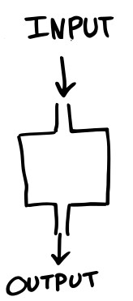

```{r setup, include=FALSE}
library(tufte)
# invalidate cache when the tufte version changes
knitr::opts_chunk$set(tidy = FALSE, cache.extra = packageVersion('tufte'))
options(htmltools.dir.version = FALSE)
```

# Getting started

Start out by installing R and then RStudio^[See installation instructions [installation.md](https://github.com/orchid00/R4da/blob/master/installation.md)]

# Hands-on Training

- This is a hands-on training!
- It is interactive which means your interaction will improve your learning
- Questions are always welcome
- Let's start with short introductions

# Starting with programing

Learn things that last longer - pick your battles - Learn the fundamentals^[["Learning to code is a never ending journey with a set of challenges and delights unique to each person"](https://twitter.com/aprilwensel/status/953387594783506433)]

# Remember

- R is case sensitive
- No spaces in names
- Be ready to learn a new language

# What is R and Rstudio

[R](https://www.r-project.org/) is a powerful programming language for data 
analysis, statistics, visualisation and more. 
[RStudio](https://www.rstudio.com/) is the program that interacts between you 
and the language R. R and RStudio are two free available software with a huge 
community of users and developers.^[[resources](https://github.com/orchid00/R4da/blob/master/resources.md)]

# What are we going to learn?

At the end of this session you will be able to:

   * Create a project for data analysis
   * Create a folder/directory structure
   * Understand and move around layouts 
   * Know where to find help
   * Import files/datasets
   * Know where packages are

# Rstudio interaction

Please create a folder called "RProjects" under "Documents" This is important 
for our project data management.

## Exercise 1 - New Rstudio Project (4 min)

^[FYI: Projects make managing multiple directories straightforward]

* RStudio menu (top left corner): click "File" menu button, then "New Project"
* Click "New Directory"
* Click "New Project" ("New empty project" if you have an older version of 
RStudio)
* In Directory name type the name of your project, e.g. "RStudio_Intro" 
  (Browse and select a folder where to locate your project, e.i. the 
  RProjects folder)
* Click the "Create Project" button

# Panes or panels

There are four main panels on RStudio. 

1. The upper-left panel is the editor where we interact with scripts. 
2. The pane in the upper-right, where it says “Environment is empty,” will show 
   the objects that you are currently working with.
3. The lower-left panel is called the console, which runs the R code. It is a 
   testing ground and only saves the code temporarily. 
4. The panel in the bottom-right will display results, files, help and more.

## Exercise 2 - Folder structure (3 min)

Create three folders in your project^[In RStudio, 
you can use the fourth panel then click "Files" then "New Folder". Or you can 
use the function `dir.create`]. [Remember](#remember) to use naming conventions or check^[[a style guide](http://style.tidyverse.org/files.html#names)].

 * scripts
 * data
 * plots

## Exercise 3 - New R script (2 min)

* RStudio menu (top left corner): click "File" menu button, then "New File", 
  then "R script". You can also create a new script with the shortcut 
  "Ctrl+Shift+N" for mac users use "cmd" instead of "ctrl".^[You can run code from a script using "Ctrl+Enter" (line by line or a selection of code)]
* Save your script. You can click on the save icon or "Ctrl+S". Select the 
  scripts folder and type a name i.e. "learning.R"
  
# Functions

{ width=10%}

# How to get help

There are three ways to find help using RStudio^[The help panel will show you 
the Documentation. How to use a function, input, details, and examples]

1. ?functioname 
2. help(functioname)
3. Press F1 or "cmd F1" on the functioname

## Exercise 4 - Check the description of these functions (2 min)

    sessionInfo
    list.files
    ls

## Exercise 5 - Add comments to your new R script file (3 min)

Comments start with #.

    # Description:
    # Author:
    # Date:

To add a section 
 
    # Starting with objects --------------------------
    
# R syntax
To get the hang of R, we start using it as a simple calculator. Type 2 + 2 directly into the console panel and press enter. You should see this:
```{r}
2 + 2
```

# R variables or objects

R can calculate and store multiple values in *variables* or *objects* so we can access them later. Use: `objectname <- value`.

* Notice the **assignment operator** `<-` 
* Value can be a given value or a result of a calculation or transformation

# R Style

I recommend two style guides:

1. [The short and simple one](https://google.github.io/styleguide/Rguide.xml)
2. [The longer and updated](http://style.tidyverse.org/)

# R data types

- numeric
- character
- logical

# Data structures

- vector
- factor
- list
- matrix
- dataframe

## Example of a numeric vector

```{r}
many_numbers <- c(1, 2, 5.3, 6, -2, 4) # numeric vector
many_numbers
```

## Exercise 6 - Create a vector (3 min)

You can create either a vector of characters or a vector of logicals

* If you create a vector of characters use quotes `""` for each value
* If you create a vector of logicals use `TRUE` and `FALSE`

```{r, echo=FALSE}
many_characters <- c("one", "two", "three") # character vector
many_characters
many_logicals <- c(TRUE, TRUE, FALSE) # logical vector
many_logicals
```

# Import files

Let's introduce some data to R

```{r, eval=FALSE}
download.file(url = "http://tiny.cc/csvexample", 
              destfile = "data/example.csv")

mydata <- read.csv(file = "data/example.csv")
```

## Exercise 7 - Importing data into R  (3 min)

* You can either download the example csv file or copy another csv file to the 
data folder.
* Read the csv file using `read.csv` ^[You can also read other kinds of file using `read.table` or special packages]
* checkout the function `str` with your new object

Tip^[Always use the [help](#how-to-get-help) in RStudio if you don't know how a function works]

# Install packages

Most [R](https://cran.r-project.org/) package you can be installed it like this:
`install.packages("packagename")`

Then you need to load it using `library(packagename)`

Then go to the fourth panel and select the packages tab, after loading a package
it should be checked.

You can also check `sessionInfo()`

## Exercise 8 - Install the ggplot2 package for graphics (3 min)

* Use what you have learned to install the ggplot2 package.
If you are keen you can install the [tidyverse](https://www.tidyverse.org/) package.

# Close project

"File" "close project" (It asks if you want to save your data), then you can close RStudio.

# Resources

There are plenty of R [resources](https://github.com/orchid00/R4da/blob/master/resources.md), this is 
only a short list.

# Feedback

Please send your annonymous feedback through this link
[http://tiny.cc/elixir_feedback](http://tiny.cc/elixir_feedback)

# Open source

This handout was written in Rmarkdown, and uses the open-source [Tufte](https://rstudio.github.io/tufte/) style. It has been published on 
[Github pages](https://pages.github.com/) and also as a 
[PDF handout](https://github.com/orchid00/R4da/blob/master/scripts/RStudioIntroNotebook.pdf). 

All of the information of my courses can be found on my Github repo [R for Data Analysis](https://github.com/orchid00/R4da). These resources are freely 
available under the Creative Commons - Attribution Licence. You may re-use and re-mix the material in any way you wish, without asking permission, **provided you cite the original source**. That is a link back to the website [R for Data Analysis](https://github.com/orchid00/R4da) and the ORCID ID 0000-0002-8990-1985.

I acknowledge this publication is resulting from support of [Elixir-Belgium](https://www.elixir-belgium.org/) for my role as data science 
and bioinformatics trainer. 

Last update: `r Sys.Date()`
