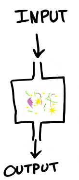
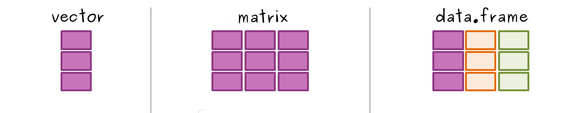

```{r setup, include=FALSE}
library(tufte)
# invalidate cache when the tufte version changes
knitr::opts_chunk$set(tidy = FALSE, cache.extra = packageVersion('tufte'))
options(htmltools.dir.version = FALSE)
```

# Getting started

Start out by installing R and then RStudio^[See installation instructions [installation.md](https://github.com/orchid00/R4da/blob/master/installation.md)]

# Remember

- R is **case sensitive**
- **No spaces** in names
- Be ready to learn a **new language**

# Hands-on Training

- This is a hands-on training :) 
- It is interactive, which means your interaction and awareness will improve 
  your learning
- Questions are always welcome
- Let's start with short introductions

# Starting with programming

Learn things that last longer - pick your battles - Learn the 
fundamentals^[["Learning to code is a never ending journey with a set of challenges and delights unique to each person"](https://twitter.com/aprilwensel/status/953387594783506433)]

# This workshop aim

On the workshop, we aim to go from gaining new knowledge to comprehension of 
the foundations of R.^[[Key levels of learning](https://sites.google.com/a/glenview34.org/aprilpdexample/_/rsrc/1468735374217/easing-into-a-1-1-classroom/promoting-higher-order-thinking-skills/blooms_taxonomy.jpg)]   

# What is R and Rstudio

[R](https://www.r-project.org/) is a powerful programming language for data analysis, statistics, visualisation and more. 
[RStudio](https://www.rstudio.com/) is the program that interacts between you 
and the R language. R and RStudio are two freely available software with a huge 
community of users and developers.^[[resources](https://github.com/orchid00/R4da/blob/master/resources.md)]

# What are we going to learn?

At the end of this session you will be able to:

   * Create a project for data analysis
   * Execute basic operations in R
   * Find an R style guide
   * Practice using the help from R in RStudio
   * Describe differences between R data types and R data structures
   * Read tabular data into R
   * Select subsets of your data
   * Describe how to diagnose programming problems and to look up 
     answers from the web or forums
   * Recall how to install packages

# Rstudio interaction

Our analysis should be located in a findable and accessible location. 
Getting used to a reusable project structure is good practice for our project
data management.

Please create a folder called **RProjects** under the **Documents** folder

## Exercise 1 - New Rstudio Project (4 min)

^[FYI: Projects make managing multiple directories straightforward]

* RStudio menu (top left corner): click **File** menu button, 
* Then **New Project**
* Click **New Directory**
* Click **New Project** 
* In Directory name type the name of your project, e.g. **Rfoundation** 
  (Browse and select a folder where to locate your project, e.i. the 
  **RProjects** folder)
* Lastly, click the **Create Project** button

# Panes or panels

There are four main panels on RStudio.
We will soon work on these panels, but first be shortly introduced.  

1. The upper-left panel is the editor where we interact with code and scripts.
2. The panel in the upper-right, where it says *Environment is empty* will 
   show you the variables that you are currently working with.
3. The lower-left panel is called the console, which runs the R code. It
   only saves the code temporarily so it is mostly used as testing ground. 
4. The panel in the bottom-right will display files, plots, packages, help and more.

## Exercise 2 - Folder structure (3 min)

Create two folders in your project

 * scripts
 * data

In RStudio, you can use the fourth panel, click **Files** then **New Folder**. 

When in doubt of naming conventions check^[[a style guide](http://adv-r.had.co.nz/Style.html)].

## Exercise 3 - New R script (2 min)

* RStudio menu (top left corner): click **File**, then **New File**, then **R script**. Did you see the shortcut? You can also create a new script with *Ctrl+Shift+N*, for mac users replace *Ctrl* for *command*. There is another button close by, maybe you already found it
* Save your script. You can click on the save icon or *Ctrl+S*. Select the **scripts** folder and type a name like **learning.R**. ^[[The **.R** extension is important for R to recognise your script]] 
* Now, check with your neighbour if they have finished too, maybe they need more time, or maybe you can help out  

## Exercise 4 - Add comments to your new R script file (3 min)

Comments start with a hash # and follows with a single space

    # Description:
    # Author:
    # Date:

To add a section 
 
    # Starting with calculations --------------------------

From now on, I will recommend you to add a new section for each exercise, and 
comments on every line.

# R syntax

Tip: To have a readable code, use spaces around all symbols and after commas. 

To get the hang of R, we start using it as a calculator. Type 2 + 2 
directly into the console panel and press enter. You should see this:
```{r}
2 + 2
```

## Exercise 5 - Try any other calculation (2 min)

* In your new script try a new calculation, and add comments
* To run code from a script you need to click *Ctrl+Enter* or click the button
  **Run** (green right direction arrow)

# R variables or objects

R can calculate, but we would also like to save these results. We can store one or multiple values in *variables* to access them later. 

* Syntax: **variableName <- value**
* Notice the symbol **<-** its called **assignment operator**  
* Values can be fixed, calculated or a result of a transformation

When in doubt of naming conventions and style check^[[a style guide](http://adv-r.had.co.nz/Style.html)].

Let's create a few variables together

```{r}
# Creating a few variables --------------------------

# text should be inside double quotes
today <- "Monday"
# numbers can be small, long or with decimals
howManyPeople <- 21
# Sometimes we need to save yes or no answers, 
# write TRUE or FALSE in upper case
myAnswer <- TRUE
```

## Exercise 6 - Naming and syntax  (4 min)

Now, stop for a sec and have a look at the style guide^[[ style guide](http://adv-r.had.co.nz/Style.html)] again and
discuss with your neighbour. If you are keen and there is time, feel free to
change the values of the variables we just created.

# Functions

{ width=10%}

# How to get help

To use functions we first need to learn how they work.

There are three ways to find help using RStudio^[The help panel will show you 
the Documentation with examples at the end]

1. ?functionName 
2. help(functionName)
3. Press **F1** or **command F1** on the functionName

From now on, I will encourage you to use the help for any new function you encounter.

## Exercise 7 - Using the help on RStudio to find your variables (1 min)

- What does `ls` stand for?
- test `ls()` on your script
- How many variables do you have in your environment?

# R data types

We had created these three variables with specific R data types

- numeric
- logical
- character

## Exercise 8 - Check the R data type of your variables using `class` (2 min)

- Articulate a description of each R data type

# Data structures

- vector
- matrix
- data.frame



## Example of a numeric vector

We use the function `c()` to combine values and create vectors

```{r}
track <- c(10, 2, 5.3, 6, -25, 14) # numeric vector
track
```

## Exercise 9 - Create a vector (3 min)

You can create either a vector of characters or a vector of logicals

* If you create a vector of characters use quotes `""` for each value
* If you create a vector of logicals use `TRUE` and `FALSE` as values

These is how the results should look
```{r, echo=FALSE}
vectorChar <- c("one", "two", "three") # character vector
vectorChar
vectorLogi <- c(TRUE, TRUE, FALSE) # logical vector
vectorLogi
```

## Exercise 10 - Discuss with your neighbour  (2 min )

- Did an error come up? Could you fix it?
- Did you use the help?
- Did you google up for hints?

## Exercise 11 - Other structures  (4 min )

Use the help to find out more about 

- `factor`
- `list`

- Can you find an example of your own data where you can use one of these structures?

# Import files

Let's introduce some data to R.

First, make sure you have a data folder! 

Remember R is **case sensitive**

```{r, eval=FALSE}
download.file(url = "http://tiny.cc/csvexample", 
              destfile = "data/example.csv")

mydata <- read.csv(file = "data/example.csv")
```

## Exercise 12 - Importing data into R  (4 min)

- Use the code above to import data into R.^[You can either read the example.csv file or copy another csv file to your data folder]
- It is recommended that you always use the help to find out more about the new 
functions before using them.^[You can also read other kinds of files using `read.table` or use functions from packages like **readr**]
- checkout the function `str` with your new variable

## Exercise 13 - Let's discuss

- what have you learned from the new functions?
- what kind of data did you read into R?
- is `str` useful? 

```{r echo=FALSE}
mydata <- read.csv(file = "../data/example.csv")
```

```{r}
# let's now create a plot
plot(x = mydata$M_At1, y = mydata$M_At2)
```


# Install packages

Most [R](https://cran.r-project.org/) packages can be installed like this:
`install.packages("packageName")`

After installing, you need to load it using `library(packageName)`. You will need to load a package for each new R session.

Then, go to the fourth panel and select the packages tab, after loading a package
it should be checked.

You can also check `sessionInfo()`

## Exercise 14 - Install the ggplot2 package for graphics (3 min)

* Use what you have learned to install the ggplot2 package.
After that, if you are keen you can install the [tidyverse](https://www.tidyverse.org/) package.

```{r warning=FALSE}
library(ggplot2)

ggplot(data = mydata, 
       mapping = aes(x = M_At1, y = M_At2)) +
  geom_point()
```

## Exercise 15 - how to find help on the web (7 min)

- Your task is now to create a new ggplot with colours.
  It can be any kind of ggplot and you can use any colour
- You need to google is out, you can work in pairs 

# This is the start of your own R self-learning path

Now look at your script, look how good you are doing, and you can keep going.

# Resources

There are plenty of R [resources](https://github.com/orchid00/R4da/blob/master/resources.md), these are only a few.

# Feedback

To finish up please send your anonymous feedback through this link before leaving
[http://tiny.cc/elixir_feedback](http://tiny.cc/elixir_feedback)

# Close project

**File** **close project** (save your data if you want), then you can close RStudio.

# Open source

This handout was written in Rmarkdown and uses the open-source style [Tufte](https://rstudio.github.io/tufte/). It has been published in 
[Github pages](https://orchid00.github.io/Rfoundation.html) and also as a 
[PDF handout](https://github.com/orchid00/R4da/raw/master/scripts/Rfoundation.pdf). 

All of the information of my courses can be found on my Github repo [R for Data Analysis](https://github.com/orchid00/R4da). These resources are freely available under the Creative Commons - Attribution Licence. You may re-use and adapt the material in any way you wish, without asking permission, **provided you cite the original source**. That is a link back to the website [R for Data Analysis](https://github.com/orchid00/R4da) and my ORCID 0000-0002-8990-1985.

I acknowledge this publication is resulting from support of [Elixir-Belgium](https://www.elixir-belgium.org/) for my role as data science and bioinformatics trainer. 

Last update: `r Sys.Date()`
